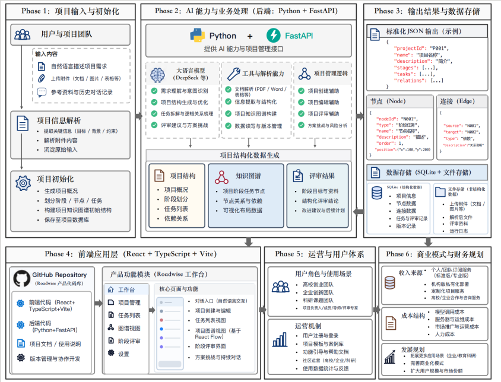
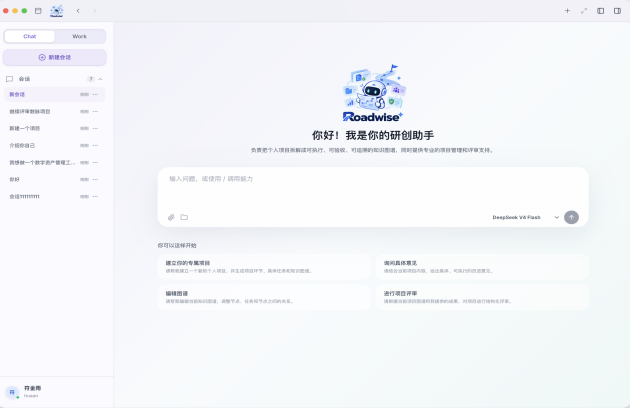

# 智行有道（Roadwise AI）

## AI 项目决策与协作平台

Roadwise AI 是 RoadwiseLab 面向高校创新创业团队、初创企业产品团队和科研小组打造的 AI 项目决策与协作工作台。

它解决的不是“如何再生成一段文字”，而是如何把一个项目从想法、材料和讨论，推进为一套清晰的目标、阶段、任务、证据和决策记录：

> 自然语言输入 → 项目结构化 → 知识图谱 → 任务执行 → 阶段评审 → 版本沉淀

平台中的 AI 不替团队做最终决策，而是帮助团队整理上下文、识别冲突、补齐证据、拆解任务，并把每轮修改和评审结果保留下来，形成可执行、可验收、可追溯的项目过程档案。

## 为什么需要 Roadwise AI

项目资料通常分散在聊天记录、文档、表格、演示文稿和会议讨论中。传统项目管理工具擅长登记任务，却难以表达任务背后的目标、假设和判断依据；知识库工具擅长存储资料，却需要人工维护项目结构；通用 Chatbot 能生成建议，却难以长期记住项目状态，也无法保证输出持续写回同一套项目数据。

Roadwise AI 将三类能力结合到一个项目空间中：

- 把零散材料整理为项目概况、阶段节点和任务清单。
- 用知识图谱呈现阶段、节点、任务和依赖关系。
- 通过阶段评审对照项目图谱与新材料，识别冲突和证据缺口。
- 用版本化记录保留每次评审、修改和用户确认，不覆盖历史结果。

## 核心功能

### 1. Agent 对话入口

用户可以通过自然语言描述项目目标、背景、问题和已有材料。系统支持上传 PDF、Word、PPT、Excel、CSV 和图片，并将其作为项目理解的输入。

平台内置四类系统能力：

| Skill | 作用 |
| --- | --- |
| `/project_create` | 创建项目，解析输入材料，生成项目结构、任务和知识图谱 |
| `/project_edit` | 修改项目节点、任务、关系和阶段安排，并同步列表与图谱 |
| `/project_review` | 基于新增材料进行阶段评审，追加新的评审版本 |
| `/grill-me` | 挑战方案、假设、风险和实施可行性 |

### 2. 项目结构化

Agent 会识别项目属于个人项目、创业项目或企业项目，并生成项目简介、项目目标、阶段划分、阶段节点、可执行任务、前置条件、依赖关系、阶段产出和验收条件。

### 3. 列表视图

列表视图面向日常执行，展示阶段、节点、任务和任务说明。用户可以编辑、删除或新增任务，并查看任务对应的输入、执行过程、判断依据和阶段产出。

### 4. 知识图谱

图谱视图使用可缩放、可拖拽的画布呈现项目全貌，展示项目、阶段、节点、任务以及相互之间的依赖、支持、冲突和验证关系。列表视图与图谱视图使用同一套项目数据源，避免出现两个页面内容不一致的问题。

### 5. 阶段评审

阶段评审会综合已有项目图谱、用户问题和新上传材料，输出当前阶段结论、图谱一致性、潜在冲突、证据缺口、风险事项、建议行动和用户待确认问题。

每次新增材料都会生成独立版本，例如 v1、v2、v3，保留本次材料、评审结论、与上一版本的变化以及后续行动。

### 6. 项目案例库

用户可以将已经完成或具有复用价值的项目存入案例库。案例库用于长期保存项目结构、方法、任务模板和阶段评审经验，支持后续复用和模板沉淀。

## 产品使用流程

1. 配置 Agent API Key 和模型。
2. 在智能体会话中描述项目需求，或上传已有材料。
3. 调用 `/project_create` 生成项目结构和初始评审。
4. 在列表视图中执行、编辑和补充任务。
5. 在图谱视图中查看阶段关系和项目全貌。
6. 补充新材料后调用 `/project_review`。
7. 对照不同评审版本，处理证据缺口和待确认问题。
8. 将成熟项目沉淀到案例库，形成可复用模板。

## 技术架构



### 前端

- React
- TypeScript
- Vite
- React Flow
- Tailwind CSS

前端负责智能体会话、项目工作台、列表视图、图谱视图、阶段评审和案例库等交互界面。

### 后端

- Python
- FastAPI
- LangGraph
- HTTPX
- Pydantic

后端负责 Agent 编排、文件解析、模型调用、项目状态处理、会话管理和结构化结果校验。

### 数据存储

当前采用 SQLite 文件型数据库，数据库位于：

```text
backend-python/data/roadwise.db
```

数据库用于保存项目状态、图谱节点、任务、评审版本、会话记录和使用量统计。API Key 不写入代码仓库，运行时配置文件也已加入 Git 忽略规则。

## AI 的核心作用

Roadwise AI 的核心不是替用户直接作出判断，而是建立项目决策过程的结构化记录。

1. **理解需求**：从用户描述和上传材料中识别项目目标、用户对象、项目类型、阶段计划和关键问题。
2. **解析材料**：读取文档、表格、演示文稿和图片中的文字、表格、图表及关键信息，并对无法确认的内容标记为待确认。
3. **拆解项目**：将自然语言项目描述转化为阶段、节点、任务、依赖和验收条件，形成可执行的知识图谱。
4. **校验一致性**：把新材料与已有图谱进行对照，检查目标、对象、时间、指标、阶段顺序和证据是否一致。
5. **支持持续评审**：每轮新增材料都形成新的评审版本，保留历史结果，帮助团队看到问题如何被发现、补充和解决。

## 项目目录

```text
RoadwiseLab-workbench/
├── frontend-source/       # React + TypeScript + Vite 前端源码
├── backend-python/        # FastAPI + LangGraph 后端服务
│   ├── app/               # Agent、API、文件解析和数据库代码
│   ├── data/              # SQLite 数据库目录
│   └── requirements.txt   # Python 依赖
├── production-build/      # 前端生产构建文件
├── standalone-html/       # 可直接用浏览器打开的单文件版本
├── output/                # 产品文档和演示产物
└── docs/assets/           # 产品架构图和界面截图
```

## 本地运行

### 启动前端

```bash
cd frontend-source
npm install
npm run dev -- --host 0.0.0.0 --port 3000
```

访问：`http://localhost:3000/`

### 启动后端

```bash
cd backend-python
python -m venv .venv
source .venv/bin/activate
pip install -r requirements.txt
uvicorn app.main:app --host 0.0.0.0 --port 4000 --reload
```

首次使用时，在产品的「API Key 配置」中输入模型服务 Key。Key 只发送给本机后端使用，不应写入源码、README、构建产物或 Git 提交。

## 当前阶段与后续计划

当前版本已经具备项目创建、项目编辑、知识图谱、阶段评审、评审版本和多格式材料解析等核心能力。

后续重点包括：

- 完善项目与用户权限隔离。
- 增强证据链和节点关系类型。
- 完善版本回滚和操作日志。
- 增加团队协作与机构级空间。
- 根据真实试点项目沉淀行业模板。
- 在需要多人协作和云端部署时迁移至 MySQL 或 PostgreSQL。

## 产品界面

### 智能体会话入口



### 项目架构示意


## 项目定位

Roadwise AI 希望成为连接“想法、材料、任务和决策”的项目基础设施：让团队不仅能生成一份方案，更能持续推进项目、保留证据、复盘过程，并把一次项目中的经验转化为下一次可以复用的方法。
